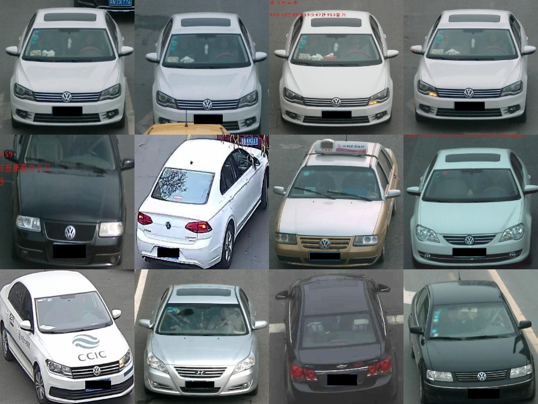
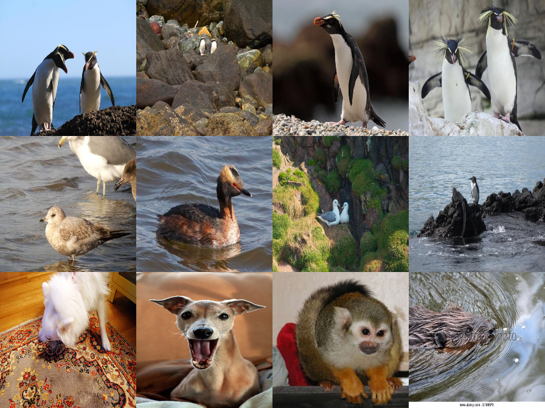

# Intro
This is the repository for CVPR2021 Dynamic Metric Learning: Towards a Scalable Metric Space to Accommodate Multiple Semantic Scales

**Vehicle Samples**

**Animal Samples**

# Downloads
You can download Dyml-datasets via One Drive or Baidu netdisk
- One Drive: https://1drv.ms/u/s!AsLhhAJIX-_0asLHa5h-56ZZL94?e=KFLdmt
- Baidu Net Disk: https://pan.baidu.com/s/1WJdELF8GdZqS7PkzsL9aRA ,password: d6nm 